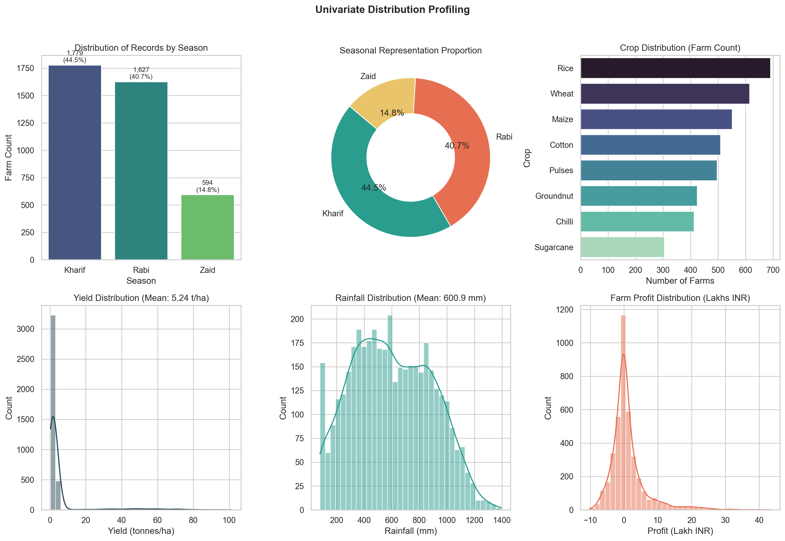
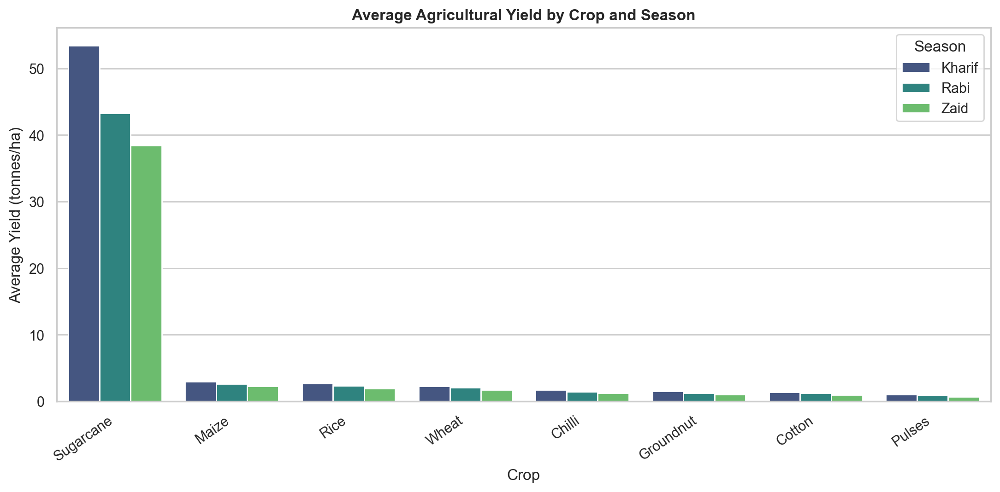
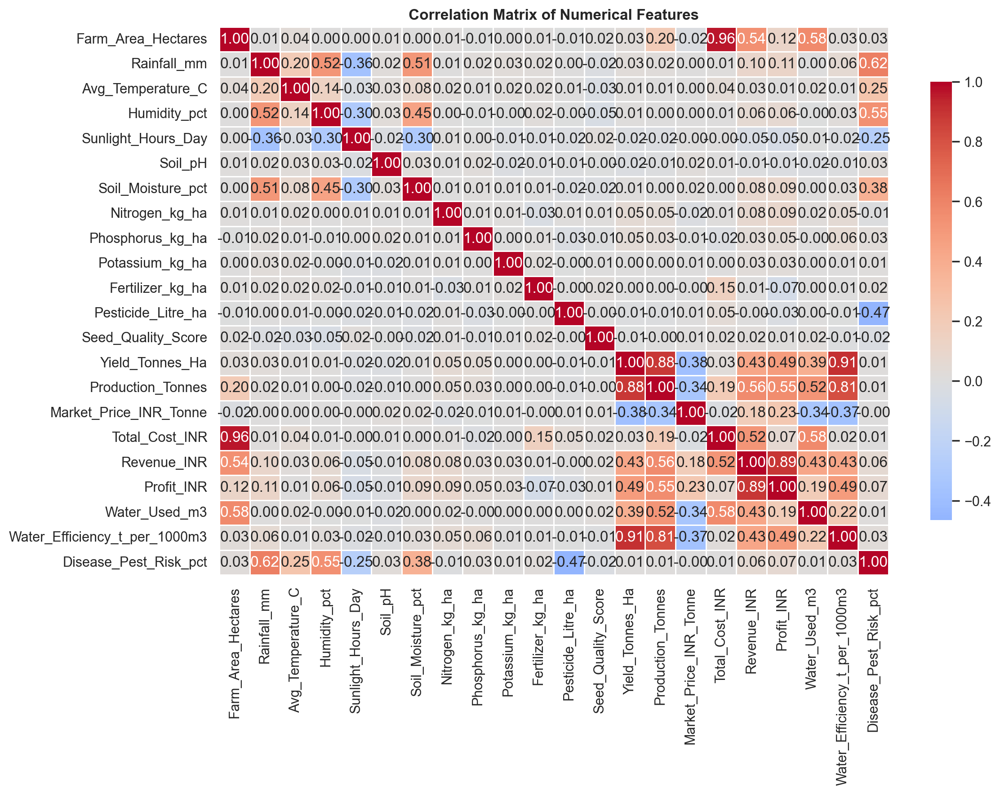
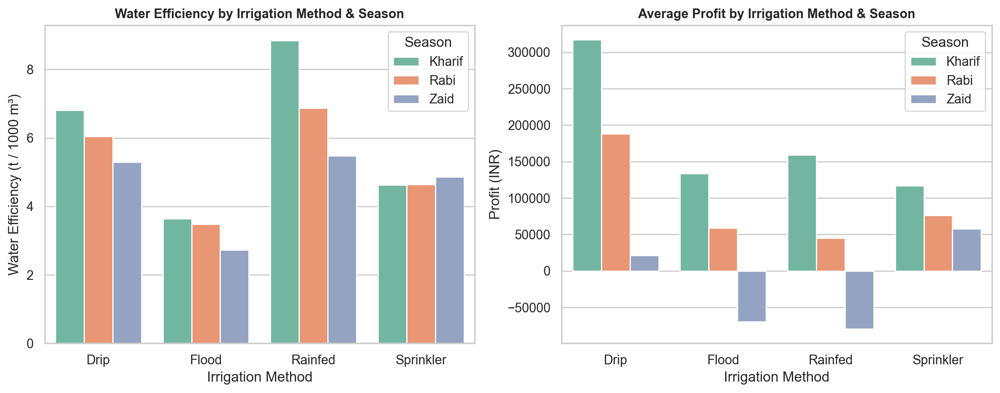
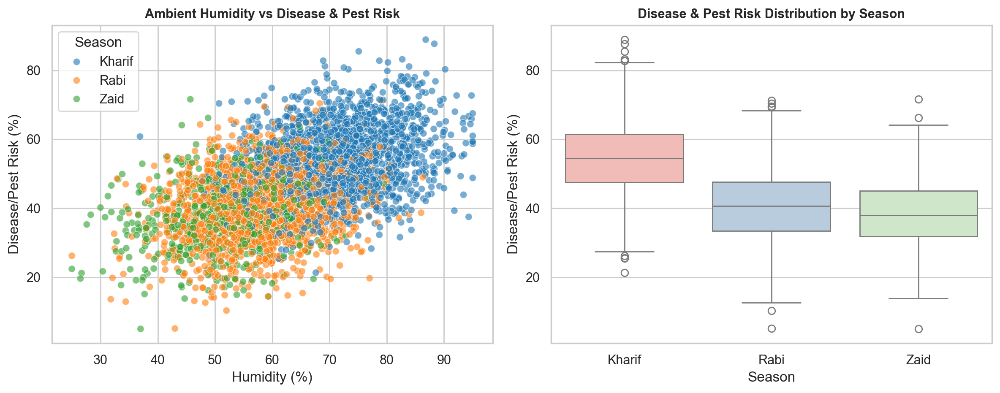
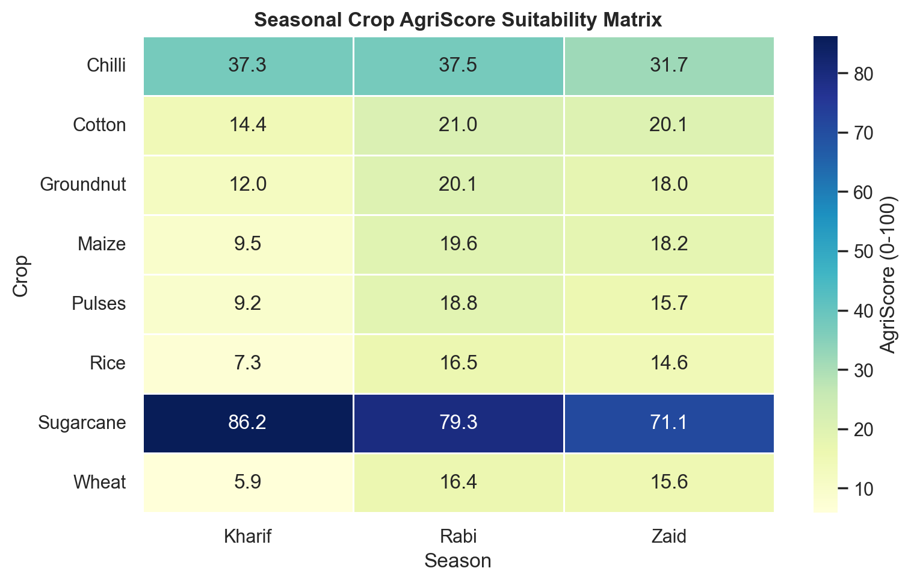

# Seasonal Agriculture Performance Analysis

An exploratory data analytics project investigating how agricultural productivity, resource efficiency, and farm economics vary across **Kharif**, **Rabi**, and **Zaid** seasons in India.

---

## Project Overview

In India, agricultural production is fundamentally shaped by seasonal climate transitions. Monsoon rainfall, winter temperature moderation, and summer heatwaves dictate crop viability, irrigation requirements, agrochemical inputs, and farmer profitability.

This project analyzes **4,000 farm-level observations** to evaluate seasonal trade-offs. Using exploratory data analysis (EDA), statistical benchmarking, targeted deep-dive modules, and a custom **AgriScore Crop Suitability Matrix**, the study provides evidence-based insights for seasonal crop selection and agricultural planning.

---

## Problem Statement

Agricultural performance varies widely across seasons due to fluctuations in rainfall, ambient temperature, relative humidity, water availability, and commodity prices. 

Raw agricultural records do not immediately show how these environmental and operational parameters interact to influence crop yields and financial margins. Without structured analysis, identifying efficiency gaps, pest vulnerabilities, and optimal seasonal crop allocations is difficult. This project evaluates farm data across Kharif, Rabi, and Zaid to identify meaningful patterns and actionable recommendations.

---

## Objectives

1. **Data Quality & Preparation:** Identify and resolve missing values, duplicate entries, data types, and potential outliers.
2. **Exploratory Data Profiling:** Perform univariate, bivariate, and multivariate analyses across environmental, operational, and financial features.
3. **Seasonal Performance Benchmarking:** Quantitatively compare yield, production, water consumption, and profit margins across seasons.
4. **Targeted Deep-Dive Analyses:**
   - *Analysis 1 (Irrigation Productivity):* Compare water efficiency and profitability across Drip, Sprinkler, Flood, and Rainfed systems.
   - *Analysis 2 (Pest & Disease Risk Drivers):* Assess how relative humidity and season drive biotic risk scores and agrochemical application.
   - *Analysis 3 (Farm-Scale Economics):* Evaluate unit profitability (cost/ha, profit/ha) across small, medium, and large landholdings.
5. **Crop Suitability Scoring (AgriScore):** Build a multi-criteria index ($0 - 100$) balancing yield, profit, water efficiency, and pest resilience.
6. **Data-Driven Insights:** Formulate evidence-based recommendations, acknowledge study limitations, and outline future scope.

---

## Dataset Description

The dataset represents farm-level records across diverse agro-climatic zones in India.

- **File Name:** `seasonal_agriculture_performance_dataset.csv`
- **Total Records:** 4,000 farm observations
- **Total Features:** 28 columns

| Feature Category | Variables | Description |
|:---|:---|:---|
| **Identifiers & Geography** | `Farm_ID`, `State`, `District` | Farm identifier and location attributes |
| **Crop & Season** | `Crop`, `Season` | Crop species (8 types) and Season (Kharif, Rabi, Zaid) |
| **Environmental & Climate** | `Rainfall_mm`, `Avg_Temperature_C`, `Humidity_pct`, `Sunlight_Hours_Day`, `Soil_pH`, `Soil_Moisture_pct` | Weather and soil parameters |
| **Inputs & Operations** | `Farm_Area_Hectares`, `Fertilizer_kg_ha`, `Pesticide_Litre_ha`, `Seed_Quality_Score`, `Irrigation_Method`, `Water_Used_m3` | Farm size, agrochemical inputs, and irrigation type |
| **Yield & Economics** | `Yield_Tonnes_Ha`, `Production_Tonnes`, `Market_Price_INR_Tonne`, `Total_Cost_INR`, `Revenue_INR`, `Profit_INR`, `Water_Efficiency_t_per_1000m3`, `Disease_Pest_Risk_pct` | Productivity, financials, efficiency, and risk scores |

---

## Tools and Technologies Used

- **Language:** Python 3.11+
- **Data Manipulation:** Pandas, NumPy
- **Data Visualization:** Matplotlib, Seaborn
- **Environment:** Jupyter Notebook / Google Colab

---

## Key Analyses & Visualizations

### 1. Exploratory Data Profiling & Univariate Analysis
Explores single-variable distributions for season representation, crop frequencies, yields, rainfall, and farm profit.



- **Seasonal Share:** Kharif accounts for **44.5%** (1,779 farms), Rabi represents **40.7%** (1,627 farms), and Zaid covers **14.8%** (594 farms).
- **Baseline Means:** Average yield is **5.22 t/ha**, mean rainfall is **600.9 mm**, and average farm profit is **₹1.03 Lakhs**.

---

### 2. Seasonal Crop Yield Benchmarking & Correlation Dynamics
Evaluates crop-specific yields across seasons and examines pairwise correlations among all numeric features.



- **Yield Leadership:** Kharif records the highest mean yield (**5.64 t/ha**) due to monsoon rainfall (**852.1 mm**), while Rabi provides stable yields (**5.08 t/ha**).
- **Cash Crops:** Sugarcane maintains high yields across seasons (~9.0–12.0 t/ha), whereas cereal yields average 3.5–5.5 t/ha.



- **Key Correlations:** Farm area strongly correlates with total production ($r = 0.88$) and revenue ($r = 0.82$). Ambient humidity strongly correlates with disease/pest risk scores.

---

### 3. Irrigation Water-Productivity Analysis (Deep-Dive 1)
Evaluates water efficiency ($t/1000\,\text{m}^3$) and profitability across Drip, Sprinkler, Flood, and Rainfed systems.



- **Drip Efficiency:** Drip irrigation delivers the highest water productivity (**6.27 $t/1000\,\text{m}^3$**) and highest average profit (**₹2.20 Lakhs**).
- **Flood Inefficiency:** Flood irrigation achieves only **3.44 $t/1000\,\text{m}^3$**, consuming ~42% more water with lower profit margins.

---

### 4. Agrochemical Drivers & Disease/Pest Risk (Deep-Dive 2)
Investigates how humidity spikes drive pest risk and pesticide application across seasons.



- **Monsoon Biotic Risk:** Kharif exhibits the highest mean disease/pest risk (**54.5%**) compared to Rabi (**40.5%**) and Zaid (**38.2%**), driven by humidity levels exceeding 70%.

---

### 5. New Feature: AgriScore Seasonal Crop Suitability Matrix
A multi-criteria scoring index ($0 - 100$) evaluating crop selection under practical constraints:

$$\text{AgriScore} = 0.35 \times \text{Yield}_{\text{norm}} + 0.35 \times \text{Profit}_{\text{norm}} + 0.15 \times \text{WaterEff}_{\text{norm}} + 0.15 \times \text{PestResilience}_{\text{norm}}$$



- **Top Performers:**
  - **Sugarcane:** Highest AgriScore in Kharif (**86.2**) and Rabi (**79.8**).
  - **Chilli:** Strong economic scores across Rabi (**37.5**) and Kharif (**37.3**).
  - **Pulses & Groundnut:** Superior water efficiency and resilience during water-scarce **Zaid** cycles.

---

## Summary of Key Findings

| # | Domain Area | Key Evidence-Based Finding | Data Value / Metric |
|:---:|:---|:---|:---|
| **1** | **Yield by Season** | Kharif achieves highest mean yield driven by monsoon rainfall | Kharif: **5.64 t/ha** vs Rabi: **5.08 t/ha** vs Zaid: **4.67 t/ha** |
| **2** | **Disease/Pest Risk** | High ambient humidity in Kharif creates elevated disease risk | Kharif: **54.5%** vs Rabi: **40.5%** vs Zaid: **38.2%** |
| **3** | **Irrigation Impact** | Drip irrigation delivers ~82% higher water efficiency than flood | Drip: **6.27 $t/1000\,\text{m}^3$** vs Flood: **3.44 $t/1000\,\text{m}^3$** |
| **4** | **Crop Economics** | Cash crops generate highest net profit per hectare | Chilli market price: **>₹1,00,000/t**; Sugarcane profit: **₹8.17L** |
| **5** | **Zaid Constraints** | Summer season suffers from severe rainfall deficits | Rainfall: **299.4 mm**; Soil moisture: **19.2%** |
| **6** | **Scale Economics** | Large farms achieve lower cost/ha through mechanization & bulk inputs | Large farms: lower unit cost and higher profit margin than $<5\,\text{ha}$ |
| **7** | **Winter Stability** | Rabi season offers the most predictable yield-to-cost ratio for grains | Wheat & Maize show lower yield variance and moderate pest risk |
| **8** | **Suitability Matrix** | AgriScore balances food security, profitability, and resource constraints | Sugarcane (**86.2**) & Chilli (**37.5**) lead overall |

---

## Practical Recommendations

1. **Subsidize Micro-Irrigation:** Expand Drip and Sprinkler adoption, especially for water-intensive cash crops and summer (Zaid) cultivation.
2. **Early Integrated Pest Management (IPM):** Implement preventive pest management protocols during the humid Kharif season to minimize crop losses.
3. **Farmer Producer Organizations (FPOs):** Encourage smallholder farmers ($<5\,\text{ha}$) to pool resources to reduce unit costs for inputs and machinery.
4. **Multi-Criteria Seasonal Planning:** Use composite scoring (such as AgriScore) to rotate cash crops with drought-resilient legumes.

---

## Limitations & Future Scope

### Limitations
- **Static Pricing:** Market prices are recorded as fixed season averages rather than reflecting real-world daily price volatility.
- **Aggregated Climate Data:** Weather variables reflect seasonal averages; localized short-term extreme events (e.g., flash floods, heatwaves) are unmodeled.
- **Capital Expenditure:** Fixed capital costs (e.g., tube-well drilling, equipment purchases) are omitted from operational cost columns.

### Future Scope
- **Time-Series Analysis:** Incorporating multi-year historical data to study climatic cycles (e.g., El Niño / La Niña impacts).
- **Spatial GIS Mapping:** District-level mapping of groundwater depletion tables and soil nutrient profiles.
- **Predictive Modeling:** Developing predictive machine learning models for yield forecasting and automated crop recommendations.

---

## Project Structure

```text
Seasonal-Agriculture-Performance-Analysis/
│
├── assets/                                           # Exported visual charts for documentation
│   ├── agriscore_matrix.png                          # AgriScore suitability heatmap
│   ├── correlation_matrix.png                        # Feature correlation heatmap
│   ├── crop_seasonal_yield.png                       # Grouped bar plot of seasonal yields
│   ├── irrigation_analysis.png                       # Irrigation water efficiency & profit plots
│   ├── pest_disease_analysis.png                     # Humidity vs pest risk scatter & boxplots
│   └── univariate_profiling.png                      # 6-panel univariate distribution grid
│
├── Seasonal_Agriculture_Performance_Data_Analytics.ipynb   # Main executed Jupyter notebook
├── seasonal_agriculture_performance_dataset.csv            # Primary dataset (4,000 records)
├── Major Project_Seasonal Agriculture Performance Analysis..pdf # Project guidelines & problem statement
├── VOIS_Major_Project_PPT_Submission_Template.pptx         # Presentation submission slide deck
└── README.md                                         # Project documentation
```

---

## How to Run the Notebook

### Prerequisites
Make sure Python 3.8+ is installed on your system.

### Installation
1. Clone this repository or download the project files:
   ```bash
   git clone https://github.com/<your-username>/Seasonal-Agriculture-Performance-Analysis.git
   cd Seasonal-Agriculture-Performance-Analysis
   ```
2. Install the required Python packages:
   ```bash
   pip install pandas numpy matplotlib seaborn jupyter
   ```

### Execution
3. Launch Jupyter Notebook:
   ```bash
   jupyter notebook
   ```
4. Open `Seasonal_Agriculture_Performance_Data_Analytics.ipynb` and select **Cell > Run All** to execute all analyses and generate the visualizations.

---

## Conclusion

This project demonstrates that agricultural performance in India is driven by seasonal climate and resource trade-offs. While **Kharif** maximizes biomass yield through monsoon precipitation, it demands careful pest management. **Rabi** provides stability and lower risk for staple food crops, and **Zaid** requires high-efficiency irrigation to be viable. By combining data hygiene, domain-driven deep-dives, and the **AgriScore Suitability Matrix**, this study provides practical, evidence-based guidance for sustainable agricultural planning.
